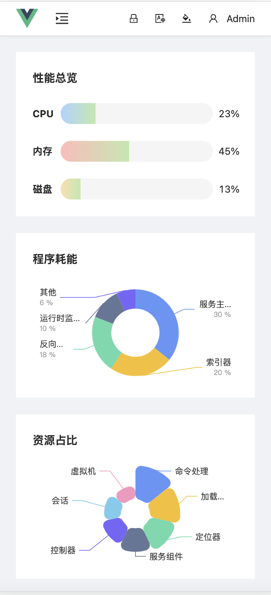

# vue-brevity-kit

## 预览

[https://yiluyanxia.github.io](https://yiluyanxia.github.io/vue-brevity-kit/dist/#/login)

## 部分截图




## 前言

新的一年，加入开源，这是计划的一部分。

## 由来

Brevity
n. 简洁；简炼；短暂

本项目秉着页面简洁、代码简练、结构简单的原则进行开发。

页面尽量从简，避免花里胡哨，是一种直抒胸臆的表达，让用户直截了当的获取信息而进行操作。

代码层面也是比较简练，没有过度的封装，只在有且必要的时候进行封装。这样也增加的代码可读性。

项目结构较为简单，因为没有太多的封装，一个方法的实现不会超过三个文件。

如此一来，Brevity 显得尤为合适。

## 受众
初学者，因为代码比较简单，所以还是比较适合初学者。  
有一定基础的人，可以了解与你想法不同的人的代码，也可以帮我找 Bug。


## 技术栈

本项目主要使用了 vite vue typescript 等技术  
UI 框架使用了 ant-design-vue  
其他的有 vue-router、pinia、axios 等  
详细信息可查看项目 package 文件 

## 推荐的 IDE 设置

[VSCode](https://code.visualstudio.com/) + [Volar](https://marketplace.visualstudio.com/items?itemName=Vue.volar) (and disable Vetur) + [TypeScript Vue Plugin (Volar)](https://marketplace.visualstudio.com/items?itemName=Vue.vscode-typescript-vue-plugin).


## 项目设置

```sh
npm install
```

```sh
npm run dev
```

```sh
npm run build
```

###  [ESLint](https://eslint.org/)

```sh
npm run lint
```

## License
[MIT](https://opensource.org/licenses/MIT)
